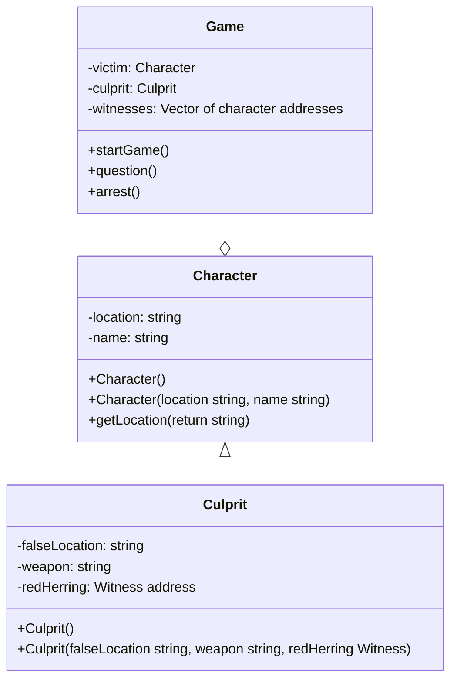

Whodunnit?!

Proposal

Brayden Wilson, CS121

Purpose
	This project is intended to demonstrate mastery of concepts learned in CS121, specifically Object-Oriented Programming, abstract data types, and class and data structures.

Overview
	Whodunnit?! is a simple text based game engine for a short murder mystery scenario. In each turn, the player will be able to question the suspects and witnesses to gather information, or make an arrest. Players will be encouraged to take their own notes, as gathering the information is part of the game.

Classes
	Whodunnit?! is planned to feature two classes, the Character class, containing a name and location at the time of the crime, and the Culprit class. The Culprit class inherits from the Character class, adding on a weapon, a false location to tell the player, and a red herring Character to throw them off.

Anticipated use cases
	The project will have two use cases. Game makers will be able to craft their own set of clues and stories. Game players will be able to explore those stories, as well as engage in randomly generated cases.

Use of object oriented programming
	This project is suited to the use of Object-Oriented Programming. It features two classes and an interface, Illustrating several main features of OOP:
Inheritance: one of the two game classes inherits from the other
Encapsulation: all of the data members are private and accessible through methods
Abstraction: the Game class is an interface through which the player will interact
Composition: the Game class holds several instances of the Character class

This system can be written in any object oriented programming language. For this project, I will use Java. There are multiple features specific to Java like interfaces that are ideal for use in this project. There will likely be no user interface outside of a standard command line interface, and there will be no outside dependencies on computers with JRE.

Milestones
- UML approved
- Basic interface
- Character class
- Question method
- Print character location and name
- Arrest method
- Remove character from list
- Tell player if they were correct
- Culprit class
- Inherit from Character
- Return different information than normal character class
- Game class
- Choose location and describe crime scene
- Give player interface
- Loop until culprit arrested
